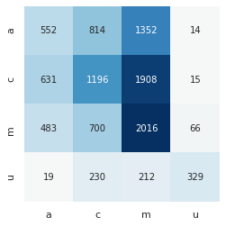
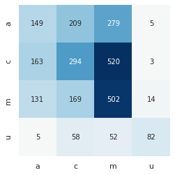

```python
from datetime import datetime
import gcsfs

# setting up file system to be ble to read from buckets

fs = gcsfs.GCSFileSystem(project='sm4h-rxspace')

now = datetime.now()
dt = now.strftime('%Y-%m-%d %H:%M')
print(f'start time:\n{dt}')

# pip instlal requirements
!pip install pandas==0.25.0;
!pip install tqdm==4.33.0;

!pip install snorkel;
!pip install spacy;
!python -m spacy download en_core_web_md;
!pip install spacy-lookup;
!pip install lemminflect;
!pip install pandas-profiling;
```

    start time:
    2020-03-25 04:02
    Requirement already satisfied: pandas==0.25.0 in /opt/conda/lib/python3.7/site-packages (0.25.0)
    Requirement already satisfied: pytz>=2017.2 in /opt/conda/lib/python3.7/site-packages (from pandas==0.25.0) (2019.3)
    Requirement already satisfied: numpy>=1.13.3 in /opt/conda/lib/python3.7/site-packages (from pandas==0.25.0) (1.18.1)
    Requirement already satisfied: python-dateutil>=2.6.1 in /opt/conda/lib/python3.7/site-packages (from pandas==0.25.0) (2.8.1)
    Requirement already satisfied: six>=1.5 in /opt/conda/lib/python3.7/site-packages (from python-dateutil>=2.6.1->pandas==0.25.0) (1.14.0)
    Collecting tqdm==4.33.0
      Using cached tqdm-4.33.0-py2.py3-none-any.whl (50 kB)
    ERROR: snorkel 0.9.3 has requirement torch<1.2.0,>=1.1.0, but you'll have torch 1.4.0 which is incompatible.
    ERROR: en-core-web-md 2.2.5 has requirement spacy>=2.2.2, but you'll have spacy 2.1.9 which is incompatible.
    Installing collected packages: tqdm
      Attempting uninstall: tqdm
        Found existing installation: tqdm 4.43.0
        Uninstalling tqdm-4.43.0:
          Successfully uninstalled tqdm-4.43.0
    Successfully installed tqdm-4.33.0
    Requirement already satisfied: snorkel in /opt/conda/lib/python3.7/site-packages (0.9.3)
    Requirement already satisfied: scikit-learn<0.22.0,>=0.20.2 in /opt/conda/lib/python3.7/site-packages (from snorkel) (0.21.3)
    Requirement already satisfied: pandas<0.26.0,>=0.25.0 in /opt/conda/lib/python3.7/site-packages (from snorkel) (0.25.0)
    Requirement already satisfied: tensorboardX<2.0,>=1.6 in /opt/conda/lib/python3.7/site-packages (from snorkel) (1.9)
    Requirement already satisfied: munkres==1.1.2 in /opt/conda/lib/python3.7/site-packages (from snorkel) (1.1.2)
    Collecting torch<1.2.0,>=1.1.0
      Using cached torch-1.1.0-cp37-cp37m-manylinux1_x86_64.whl (676.9 MB)
    Requirement already satisfied: networkx<2.4,>=2.2 in /opt/conda/lib/python3.7/site-packages (from snorkel) (2.3)
    Requirement already satisfied: tqdm<5.0.0,>=4.33.0 in /opt/conda/lib/python3.7/site-packages (from snorkel) (4.33.0)
    Requirement already satisfied: scipy<2.0.0,>=1.2.0 in /opt/conda/lib/python3.7/site-packages (from snorkel) (1.4.1)
    Requirement already satisfied: numpy<2.0.0,>=1.16.0 in /opt/conda/lib/python3.7/site-packages (from snorkel) (1.18.1)
    Requirement already satisfied: joblib>=0.11 in /opt/conda/lib/python3.7/site-packages (from scikit-learn<0.22.0,>=0.20.2->snorkel) (0.14.1)
    Requirement already satisfied: python-dateutil>=2.6.1 in /opt/conda/lib/python3.7/site-packages (from pandas<0.26.0,>=0.25.0->snorkel) (2.8.1)
    Requirement already satisfied: pytz>=2017.2 in /opt/conda/lib/python3.7/site-packages (from pandas<0.26.0,>=0.25.0->snorkel) (2019.3)
    Requirement already satisfied: protobuf>=3.8.0 in /opt/conda/lib/python3.7/site-packages (from tensorboardX<2.0,>=1.6->snorkel) (3.11.4)
    Requirement already satisfied: six in /opt/conda/lib/python3.7/site-packages (from tensorboardX<2.0,>=1.6->snorkel) (1.14.0)
    Requirement already satisfied: decorator>=4.3.0 in /opt/conda/lib/python3.7/site-packages (from networkx<2.4,>=2.2->snorkel) (4.4.2)
    Requirement already satisfied: setuptools in /opt/conda/lib/python3.7/site-packages (from protobuf>=3.8.0->tensorboardX<2.0,>=1.6->snorkel) (46.0.0.post20200311)
    ERROR: allennlp 0.9.0 has requirement torch>=1.2.0, but you'll have torch 1.1.0 which is incompatible.
    Installing collected packages: torch
      Attempting uninstall: torch
        Found existing installation: torch 1.4.0
        Uninstalling torch-1.4.0:
          Successfully uninstalled torch-1.4.0
    Successfully installed torch-1.1.0
    Requirement already satisfied: spacy in /opt/conda/lib/python3.7/site-packages (2.1.9)
    Requirement already satisfied: preshed<2.1.0,>=2.0.1 in /opt/conda/lib/python3.7/site-packages (from spacy) (2.0.1)
    Requirement already satisfied: murmurhash<1.1.0,>=0.28.0 in /opt/conda/lib/python3.7/site-packages (from spacy) (1.0.2)
    Requirement already satisfied: thinc<7.1.0,>=7.0.8 in /opt/conda/lib/python3.7/site-packages (from spacy) (7.0.8)
    Requirement already satisfied: plac<1.0.0,>=0.9.6 in /opt/conda/lib/python3.7/site-packages (from spacy) (0.9.6)
    Requirement already satisfied: numpy>=1.15.0 in /opt/conda/lib/python3.7/site-packages (from spacy) (1.18.1)
    Requirement already satisfied: srsly<1.1.0,>=0.0.6 in /opt/conda/lib/python3.7/site-packages (from spacy) (1.0.2)
    Requirement already satisfied: requests<3.0.0,>=2.13.0 in /opt/conda/lib/python3.7/site-packages (from spacy) (2.23.0)
    Requirement already satisfied: cymem<2.1.0,>=2.0.2 in /opt/conda/lib/python3.7/site-packages (from spacy) (2.0.3)
    Requirement already satisfied: wasabi<1.1.0,>=0.2.0 in /opt/conda/lib/python3.7/site-packages (from spacy) (0.6.0)
    Requirement already satisfied: blis<0.3.0,>=0.2.2 in /opt/conda/lib/python3.7/site-packages (from spacy) (0.2.4)
    Requirement already satisfied: tqdm<5.0.0,>=4.10.0 in /opt/conda/lib/python3.7/site-packages (from thinc<7.1.0,>=7.0.8->spacy) (4.33.0)
    Requirement already satisfied: idna<3,>=2.5 in /opt/conda/lib/python3.7/site-packages (from requests<3.0.0,>=2.13.0->spacy) (2.9)
    Requirement already satisfied: chardet<4,>=3.0.2 in /opt/conda/lib/python3.7/site-packages (from requests<3.0.0,>=2.13.0->spacy) (3.0.4)
    Requirement already satisfied: urllib3!=1.25.0,!=1.25.1,<1.26,>=1.21.1 in /opt/conda/lib/python3.7/site-packages (from requests<3.0.0,>=2.13.0->spacy) (1.25.7)
    Requirement already satisfied: certifi>=2017.4.17 in /opt/conda/lib/python3.7/site-packages (from requests<3.0.0,>=2.13.0->spacy) (2019.11.28)
    Collecting en_core_web_md==2.1.0
      Downloading https://github.com/explosion/spacy-models/releases/download/en_core_web_md-2.1.0/en_core_web_md-2.1.0.tar.gz (95.4 MB)
         |████████████████████████████████| 95.4 MB 97 kB/s eta 0:00:0101
    [?25hBuilding wheels for collected packages: en-core-web-md
      Building wheel for en-core-web-md (setup.py) ... [?25ldone
    [?25h  Created wheel for en-core-web-md: filename=en_core_web_md-2.1.0-py3-none-any.whl size=97126236 sha256=c14d1218b6108f9f243d8a8501fe754a9e7a430dc4ef064fc657789f5f2af996
      Stored in directory: /tmp/pip-ephem-wheel-cache-nzvlb2np/wheels/1a/4e/53/ca2bd8efb94658d2425a0a2d998ffddc2db7ea1378421f8565
    Successfully built en-core-web-md
    Installing collected packages: en-core-web-md
      Attempting uninstall: en-core-web-md
        Found existing installation: en-core-web-md 2.2.5
        Uninstalling en-core-web-md-2.2.5:
          Successfully uninstalled en-core-web-md-2.2.5
    Successfully installed en-core-web-md-2.1.0
    ✔ Download and installation successful
    You can now load the model via spacy.load('en_core_web_md')
    Requirement already satisfied: spacy-lookup in /opt/conda/lib/python3.7/site-packages (0.1.0)
    Requirement already satisfied: spacy<3.0.0,>=2.0.16 in /opt/conda/lib/python3.7/site-packages (from spacy-lookup) (2.1.9)
    Requirement already satisfied: flashtext>=2.7 in /opt/conda/lib/python3.7/site-packages (from spacy-lookup) (2.7)
    Requirement already satisfied: thinc<7.1.0,>=7.0.8 in /opt/conda/lib/python3.7/site-packages (from spacy<3.0.0,>=2.0.16->spacy-lookup) (7.0.8)
    Requirement already satisfied: cymem<2.1.0,>=2.0.2 in /opt/conda/lib/python3.7/site-packages (from spacy<3.0.0,>=2.0.16->spacy-lookup) (2.0.3)
    Requirement already satisfied: blis<0.3.0,>=0.2.2 in /opt/conda/lib/python3.7/site-packages (from spacy<3.0.0,>=2.0.16->spacy-lookup) (0.2.4)
    Requirement already satisfied: srsly<1.1.0,>=0.0.6 in /opt/conda/lib/python3.7/site-packages (from spacy<3.0.0,>=2.0.16->spacy-lookup) (1.0.2)
    Requirement already satisfied: wasabi<1.1.0,>=0.2.0 in /opt/conda/lib/python3.7/site-packages (from spacy<3.0.0,>=2.0.16->spacy-lookup) (0.6.0)
    Requirement already satisfied: requests<3.0.0,>=2.13.0 in /opt/conda/lib/python3.7/site-packages (from spacy<3.0.0,>=2.0.16->spacy-lookup) (2.23.0)
    Requirement already satisfied: murmurhash<1.1.0,>=0.28.0 in /opt/conda/lib/python3.7/site-packages (from spacy<3.0.0,>=2.0.16->spacy-lookup) (1.0.2)
    Requirement already satisfied: numpy>=1.15.0 in /opt/conda/lib/python3.7/site-packages (from spacy<3.0.0,>=2.0.16->spacy-lookup) (1.18.1)
    Requirement already satisfied: plac<1.0.0,>=0.9.6 in /opt/conda/lib/python3.7/site-packages (from spacy<3.0.0,>=2.0.16->spacy-lookup) (0.9.6)
    Requirement already satisfied: preshed<2.1.0,>=2.0.1 in /opt/conda/lib/python3.7/site-packages (from spacy<3.0.0,>=2.0.16->spacy-lookup) (2.0.1)
    Requirement already satisfied: tqdm<5.0.0,>=4.10.0 in /opt/conda/lib/python3.7/site-packages (from thinc<7.1.0,>=7.0.8->spacy<3.0.0,>=2.0.16->spacy-lookup) (4.33.0)
    Requirement already satisfied: chardet<4,>=3.0.2 in /opt/conda/lib/python3.7/site-packages (from requests<3.0.0,>=2.13.0->spacy<3.0.0,>=2.0.16->spacy-lookup) (3.0.4)
    Requirement already satisfied: urllib3!=1.25.0,!=1.25.1,<1.26,>=1.21.1 in /opt/conda/lib/python3.7/site-packages (from requests<3.0.0,>=2.13.0->spacy<3.0.0,>=2.0.16->spacy-lookup) (1.25.7)
    Requirement already satisfied: certifi>=2017.4.17 in /opt/conda/lib/python3.7/site-packages (from requests<3.0.0,>=2.13.0->spacy<3.0.0,>=2.0.16->spacy-lookup) (2019.11.28)
    Requirement already satisfied: idna<3,>=2.5 in /opt/conda/lib/python3.7/site-packages (from requests<3.0.0,>=2.13.0->spacy<3.0.0,>=2.0.16->spacy-lookup) (2.9)
    Requirement already satisfied: lemminflect in /opt/conda/lib/python3.7/site-packages (0.2.1)
    Requirement already satisfied: numpy in /opt/conda/lib/python3.7/site-packages (from lemminflect) (1.18.1)
    Requirement already satisfied: pandas-profiling in /opt/conda/lib/python3.7/site-packages (2.4.0)
    Requirement already satisfied: jinja2>=2.8 in /opt/conda/lib/python3.7/site-packages (from pandas-profiling) (2.11.1)
    Requirement already satisfied: matplotlib>=1.4 in /opt/conda/lib/python3.7/site-packages (from pandas-profiling) (3.2.0)
    Requirement already satisfied: astropy in /opt/conda/lib/python3.7/site-packages (from pandas-profiling) (4.0)
    Requirement already satisfied: phik>=0.9.8 in /opt/conda/lib/python3.7/site-packages (from pandas-profiling) (0.9.10)
    Requirement already satisfied: missingno>=0.4.2 in /opt/conda/lib/python3.7/site-packages (from pandas-profiling) (0.4.2)
    Requirement already satisfied: htmlmin>=0.1.12 in /opt/conda/lib/python3.7/site-packages (from pandas-profiling) (0.1.12)
    Requirement already satisfied: pandas>=0.19 in /opt/conda/lib/python3.7/site-packages (from pandas-profiling) (0.25.0)
    Requirement already satisfied: confuse>=1.0.0 in /opt/conda/lib/python3.7/site-packages (from pandas-profiling) (1.0.0)
    Requirement already satisfied: MarkupSafe>=0.23 in /opt/conda/lib/python3.7/site-packages (from jinja2>=2.8->pandas-profiling) (1.1.1)
    Requirement already satisfied: kiwisolver>=1.0.1 in /opt/conda/lib/python3.7/site-packages (from matplotlib>=1.4->pandas-profiling) (1.1.0)
    Requirement already satisfied: numpy>=1.11 in /opt/conda/lib/python3.7/site-packages (from matplotlib>=1.4->pandas-profiling) (1.18.1)
    Requirement already satisfied: cycler>=0.10 in /opt/conda/lib/python3.7/site-packages (from matplotlib>=1.4->pandas-profiling) (0.10.0)
    Requirement already satisfied: pyparsing!=2.0.4,!=2.1.2,!=2.1.6,>=2.0.1 in /opt/conda/lib/python3.7/site-packages (from matplotlib>=1.4->pandas-profiling) (2.4.6)
    Requirement already satisfied: python-dateutil>=2.1 in /opt/conda/lib/python3.7/site-packages (from matplotlib>=1.4->pandas-profiling) (2.8.1)
    Requirement already satisfied: joblib>=0.14.1 in /opt/conda/lib/python3.7/site-packages (from phik>=0.9.8->pandas-profiling) (0.14.1)
    Requirement already satisfied: jupyter-client>=5.2.3 in /opt/conda/lib/python3.7/site-packages (from phik>=0.9.8->pandas-profiling) (6.0.0)
    Requirement already satisfied: pytest>=4.0.2 in /opt/conda/lib/python3.7/site-packages (from phik>=0.9.8->pandas-profiling) (5.3.5)
    Requirement already satisfied: nbconvert>=5.3.1 in /opt/conda/lib/python3.7/site-packages (from phik>=0.9.8->pandas-profiling) (5.6.1)
    Requirement already satisfied: numba>=0.38.1 in /opt/conda/lib/python3.7/site-packages (from phik>=0.9.8->pandas-profiling) (0.48.0)
    Requirement already satisfied: pytest-pylint>=0.13.0 in /opt/conda/lib/python3.7/site-packages (from phik>=0.9.8->pandas-profiling) (0.14.1)
    Requirement already satisfied: scipy>=1.1.0 in /opt/conda/lib/python3.7/site-packages (from phik>=0.9.8->pandas-profiling) (1.4.1)
    Requirement already satisfied: seaborn in /opt/conda/lib/python3.7/site-packages (from missingno>=0.4.2->pandas-profiling) (0.10.0)
    Requirement already satisfied: pytz>=2017.2 in /opt/conda/lib/python3.7/site-packages (from pandas>=0.19->pandas-profiling) (2019.3)
    Requirement already satisfied: pyyaml in /opt/conda/lib/python3.7/site-packages (from confuse>=1.0.0->pandas-profiling) (5.3)
    Requirement already satisfied: setuptools in /opt/conda/lib/python3.7/site-packages (from kiwisolver>=1.0.1->matplotlib>=1.4->pandas-profiling) (46.0.0.post20200311)
    Requirement already satisfied: six in /opt/conda/lib/python3.7/site-packages (from cycler>=0.10->matplotlib>=1.4->pandas-profiling) (1.14.0)
    Requirement already satisfied: tornado>=4.1 in /opt/conda/lib/python3.7/site-packages (from jupyter-client>=5.2.3->phik>=0.9.8->pandas-profiling) (6.0.4)
    Requirement already satisfied: traitlets in /opt/conda/lib/python3.7/site-packages (from jupyter-client>=5.2.3->phik>=0.9.8->pandas-profiling) (4.3.3)
    Requirement already satisfied: jupyter-core>=4.6.0 in /opt/conda/lib/python3.7/site-packages (from jupyter-client>=5.2.3->phik>=0.9.8->pandas-profiling) (4.6.3)
    Requirement already satisfied: pyzmq>=13 in /opt/conda/lib/python3.7/site-packages (from jupyter-client>=5.2.3->phik>=0.9.8->pandas-profiling) (19.0.0)
    Requirement already satisfied: py>=1.5.0 in /opt/conda/lib/python3.7/site-packages (from pytest>=4.0.2->phik>=0.9.8->pandas-profiling) (1.8.1)
    Requirement already satisfied: packaging in /opt/conda/lib/python3.7/site-packages (from pytest>=4.0.2->phik>=0.9.8->pandas-profiling) (20.1)
    Requirement already satisfied: attrs>=17.4.0 in /opt/conda/lib/python3.7/site-packages (from pytest>=4.0.2->phik>=0.9.8->pandas-profiling) (19.3.0)
    Requirement already satisfied: more-itertools>=4.0.0 in /opt/conda/lib/python3.7/site-packages (from pytest>=4.0.2->phik>=0.9.8->pandas-profiling) (8.2.0)
    Requirement already satisfied: pluggy<1.0,>=0.12 in /opt/conda/lib/python3.7/site-packages (from pytest>=4.0.2->phik>=0.9.8->pandas-profiling) (0.13.0)
    Requirement already satisfied: wcwidth in /opt/conda/lib/python3.7/site-packages (from pytest>=4.0.2->phik>=0.9.8->pandas-profiling) (0.1.8)
    Requirement already satisfied: importlib-metadata>=0.12 in /opt/conda/lib/python3.7/site-packages (from pytest>=4.0.2->phik>=0.9.8->pandas-profiling) (1.5.0)
    Requirement already satisfied: testpath in /opt/conda/lib/python3.7/site-packages (from nbconvert>=5.3.1->phik>=0.9.8->pandas-profiling) (0.4.4)
    Requirement already satisfied: pandocfilters>=1.4.1 in /opt/conda/lib/python3.7/site-packages (from nbconvert>=5.3.1->phik>=0.9.8->pandas-profiling) (1.4.2)
    Requirement already satisfied: entrypoints>=0.2.2 in /opt/conda/lib/python3.7/site-packages (from nbconvert>=5.3.1->phik>=0.9.8->pandas-profiling) (0.3)
    Requirement already satisfied: nbformat>=4.4 in /opt/conda/lib/python3.7/site-packages (from nbconvert>=5.3.1->phik>=0.9.8->pandas-profiling) (5.0.4)
    Requirement already satisfied: defusedxml in /opt/conda/lib/python3.7/site-packages (from nbconvert>=5.3.1->phik>=0.9.8->pandas-profiling) (0.6.0)
    Requirement already satisfied: bleach in /opt/conda/lib/python3.7/site-packages (from nbconvert>=5.3.1->phik>=0.9.8->pandas-profiling) (3.1.1)
    Requirement already satisfied: pygments in /opt/conda/lib/python3.7/site-packages (from nbconvert>=5.3.1->phik>=0.9.8->pandas-profiling) (2.6.1)
    Requirement already satisfied: mistune<2,>=0.8.1 in /opt/conda/lib/python3.7/site-packages (from nbconvert>=5.3.1->phik>=0.9.8->pandas-profiling) (0.8.4)
    Requirement already satisfied: llvmlite<0.32.0,>=0.31.0dev0 in /opt/conda/lib/python3.7/site-packages (from numba>=0.38.1->phik>=0.9.8->pandas-profiling) (0.31.0)
    Requirement already satisfied: pylint>=1.4.5 in /opt/conda/lib/python3.7/site-packages (from pytest-pylint>=0.13.0->phik>=0.9.8->pandas-profiling) (2.4.4)
    Requirement already satisfied: decorator in /opt/conda/lib/python3.7/site-packages (from traitlets->jupyter-client>=5.2.3->phik>=0.9.8->pandas-profiling) (4.4.2)
    Requirement already satisfied: ipython-genutils in /opt/conda/lib/python3.7/site-packages (from traitlets->jupyter-client>=5.2.3->phik>=0.9.8->pandas-profiling) (0.2.0)
    Requirement already satisfied: zipp>=0.5 in /opt/conda/lib/python3.7/site-packages (from importlib-metadata>=0.12->pytest>=4.0.2->phik>=0.9.8->pandas-profiling) (3.1.0)
    Requirement already satisfied: jsonschema!=2.5.0,>=2.4 in /opt/conda/lib/python3.7/site-packages (from nbformat>=4.4->nbconvert>=5.3.1->phik>=0.9.8->pandas-profiling) (3.2.0)
    Requirement already satisfied: webencodings in /opt/conda/lib/python3.7/site-packages (from bleach->nbconvert>=5.3.1->phik>=0.9.8->pandas-profiling) (0.5.1)
    Requirement already satisfied: astroid<2.4,>=2.3.0 in /opt/conda/lib/python3.7/site-packages (from pylint>=1.4.5->pytest-pylint>=0.13.0->phik>=0.9.8->pandas-profiling) (2.3.3)
    Requirement already satisfied: isort<5,>=4.2.5 in /opt/conda/lib/python3.7/site-packages (from pylint>=1.4.5->pytest-pylint>=0.13.0->phik>=0.9.8->pandas-profiling) (4.3.21)
    Requirement already satisfied: mccabe<0.7,>=0.6 in /opt/conda/lib/python3.7/site-packages (from pylint>=1.4.5->pytest-pylint>=0.13.0->phik>=0.9.8->pandas-profiling) (0.6.1)
    Requirement already satisfied: pyrsistent>=0.14.0 in /opt/conda/lib/python3.7/site-packages (from jsonschema!=2.5.0,>=2.4->nbformat>=4.4->nbconvert>=5.3.1->phik>=0.9.8->pandas-profiling) (0.15.7)
    Requirement already satisfied: wrapt==1.11.* in /opt/conda/lib/python3.7/site-packages (from astroid<2.4,>=2.3.0->pylint>=1.4.5->pytest-pylint>=0.13.0->phik>=0.9.8->pandas-profiling) (1.11.2)
    Requirement already satisfied: lazy-object-proxy==1.4.* in /opt/conda/lib/python3.7/site-packages (from astroid<2.4,>=2.3.0->pylint>=1.4.5->pytest-pylint>=0.13.0->phik>=0.9.8->pandas-profiling) (1.4.3)
    Requirement already satisfied: typed-ast<1.5,>=1.4.0; implementation_name == "cpython" and python_version < "3.8" in /opt/conda/lib/python3.7/site-packages (from astroid<2.4,>=2.3.0->pylint>=1.4.5->pytest-pylint>=0.13.0->phik>=0.9.8->pandas-profiling) (1.4.1)


```python
# importing functions and etc
import spacy
from spacy.tokens import Doc, Span, Token
from spacy_lookup import Entity
from lemminflect import getAllInflectionsOOV
from spacy.matcher import Matcher
import en_core_web_md
import re
from snorkel.labeling import labeling_function, LabelModel, PandasLFApplier, LFAnalysis
from snorkel.preprocess import preprocessor
import io
import pandas as pd
pd.set_option('display.max_colwidth', 0)
import numpy as np
import itertools
from sklearn.metrics import confusion_matrix
import matplotlib.pyplot as plt
import seaborn as sn

```


```python
train_path = "gs://sm4h-rxspace/task4/train.csv"
dev_path = "gs://sm4h-rxspace/task4/validation.csv"
print(f'train path : {train_path}\ndev path : {dev_path}')
```

    train path : gs://sm4h-rxspace/task4/train.csv
    dev path : gs://sm4h-rxspace/task4/validation.csv


```python
def get_distribution(df, col='class'):
    """gives distribution of a column """
    df_out = df[col].value_counts()
    n_train = df.shape[0]
    print(f"loaded {n_train} samples\n")

    df_out = pd.DataFrame(df_out)
    df_out.columns = ['class counts']
    df_out['class %'] = round(100 * df_out['class counts'] / n_train, 2)
    return df_out

df_raw = pd.read_csv(train_path)
df_raw['class'] = df_raw['class'].map(str.strip) # some labels have a trailing space
df_train = df_raw[['unprocessed_text']].rename(columns={'unprocessed_text':'text'})
df_labels = df_raw[['class']]

print(f'loading train from {train_path}..')

print(get_distribution(df_raw))
```

    loading train from gs://sm4h-rxspace/task4/train.csv..
    loaded 10537 samples
    
       class counts  class %
    m  5488          52.08  
    c  2940          27.90  
    a  1685          15.99  
    u  424           4.02   


```python
df_val_raw = pd.read_csv(dev_path)
df_val_raw['class'] = df_val_raw['class'].map(str.strip)

df_val = df_val_raw[['unprocessed_text']].rename(columns={'unprocessed_text':'text'})
df_val_labels = df_val_raw[['class']]
print(f'loading dev from {dev_path}..')
print(get_distribution(df_val_raw))
```

    loading dev from gs://sm4h-rxspace/task4/validation.csv..
    loaded 2635 samples
    
       class counts  class %
    m  1353          51.35  
    c  730           27.70  
    a  448           17.00  
    u  104           3.95   


```python
# loading bseline spacy model
nlp = en_core_web_md.load()

ABSTAIN = -1
ABUSE = 0
MENTION = 1
CONSUMPTION = 2
UNRELATED = 3
```


```python
# TODO : add Whitley and Mark's drug list into the drugs dictionary
# drugname, is_slang, is_commonly_abused
drugs = {
    'alprazolam' : {
        'is_commonly_abused' : True,
        'slang_terms' : [
            'xanny', 'xannies'],
        'normal_terms' : [
            'xanax', 'xan', 'xanex', 'niravam'],
    },
    'codeine' : {
        'is_commonly_abused' : True,
        'slang_terms' : [],
        'normal_terms' : [
            'codeine', 'codiene', 'cocet'],
    },
    'adderall' : {
        'is_commonly_abused' : True,
        'slang_terms' : [
            'addy', 'addies', 'addys'],
        'normal_terms' : [
            'adderall', 'aderall', 'adarall', 'addarall', 'adoral'],
    },
    'valium' : {
        'is_commonly_abused' : False,
        'slang_terms' : [],
        'normal_terms' : [
            'valium', 'vallium'],
    },
    'vyvanse' : {
        'is_commonly_abused' : True,
        'slang_terms' : [],
        'normal_terms' : [
            'vyvanse'],
    },
    'fentanyl' : {
        'is_commonly_abused' : True,
        'slang_terms' : [],
        'normal_terms' : [
            'fentanyl', 'fentynyl', 'fentenyl', 'fentanil', 'abstral', 
            'actiq', 'fentora', 'onsolis', 'sublimaze', 'duragesic'],
    },
    'oxycodone' : {
        'is_commonly_abused' : True,
        'slang_terms' : ['oxy'],
        'normal_terms' : [
            'oxycodone', 'oxaydo', 'xtampza', 'oxycontin', 'oxycotin', 'oxycodin'],
    },
    'hydrocodone' : {
        'is_commonly_abused' : True,
        'slang_terms' : [],
        'normal_terms' : [
            'hydrocodone', 'hysingla', 'zohydro', 'vicodin', 'hycet',
            'lorcet', 'lortab', 'norco', 'verdrocet', 'xodol'],
    },
    'methadone' : {
        'is_commonly_abused' : False,
        'slang_terms' : [],
        'normal_terms' : [
            'methadone', 'dolophine', 'methadose'],
    },
    'morphine' : {'is_commonly_abused' : True,
                  'slang_terms' : [],
                  'normal_terms' : ['morphine', 'avinza', 'oramorph', 'roxanol', 'rms'],
                },
    'diazepam' : {'is_commonly_abused' : True,
                  'slang_terms' : [],
                  'normal_terms' : ['diazepam', 'valium'],
            },
    'tramadol' : {'is_commonly_abused' : False,
                  'slang_terms' : [],
                  'normal_terms' : ['tramadol', 'ultram'],
            },
    'quetiapine' : {'is_commonly_abused' : False,
                    'slang_terms' : [],
                    'normal_terms' : ['quetiapine', 'seroquel'],
            },
    'lorazepam' : {'is_commonly_abused' : False,
                    'slang_terms' : [],
                    'normal_terms' : ['lorazepam', 'ativan'],
            },
    'clonazepam' : {'is_commonly_abused' : True,
                    'slang_terms' : [],
                    'normal_terms' : ['clonazepam', 'klonopin'],
            },
    'percocet' : {'is_commonly_abused' : True,
                  'slang_terms' : ['percs', 'perc'],
                  'normal_terms' : ['percocet', 'percacet', 'percicet'],
            },
    'aripiprazole' : {'is_commonly_abused' : False,
                      'slang_terms' : [],
                      'normal_terms' : ['aripiprazole', 'abilify'],
            },
    'buprenorphine' : {'is_commonly_abused' : False,
                       'slang_terms' : [],
                       'normal_terms' : ['buprenorphine', 'suboxone', 'naloxone', 'bunavail', 'zubsolv'],
            },
    'olanzapine' : {'is_commonly_abused' : False,
                    'slang_terms' : [],
                    'normal_terms' : ['olanzapine', 'zyprexa', 'zydis'],
            },
    'methylphenidate' : {'is_commonly_abused' : True,
                         'slang_terms' : [],
                         'normal_terms' : ['methylphenidate', 'aptensio', 'concerta', 'cotempla', 'metadate',
                                           'methylin',  'quillichew', 'quillivant', 'ritalin'],
            },
    'risperidone' : {'is_commonly_abused' : False,
                    'slang_terms' : [],
                    'normal_terms' : ['risperidone ', 'risperdal'],
            },
    'caffeine' : {'is_commonly_abused' : False,
                    'slang_terms' : [],
                    'normal_terms' : ['caffeine', 'caffiene', 'coffee'],
            },
    'amphetamine' : {'is_commonly_abused' : False,
                    'slang_terms' : [],
                    'normal_terms' : ['amphetamine', 'adzenys', 'dyanavel'],
            },
    'hydromorphone' : {'is_commonly_abused' : False,
                    'slang_terms' : [],
                    'normal_terms' : ['hydromorphone', 'dilaudid', 'exalgo', 'hydrostat'],
            },
}


verbs_slang = {'snort', 'crush', 'inject', 'pop', 'rail', 'sniff', 'trip', 'chug'
               'spill', 'binge', 'sling', 'slang', 'snortin'}


# generate dict that maps terms to keys and values includ parent term, is_slang, is_commonly_abused
drug_term_LUT = {}

for parent_term, subdict in drugs.items():
    for slang_term in subdict['slang_terms']:
        drug_term_LUT[slang_term] = {
        'parent_term' : parent_term,
        'is_slang' : True,
        'is_commonly_abused' : subdict['is_commonly_abused']
    }
        
    for normal_term in subdict['normal_terms']:
        drug_term_LUT[normal_term] = {
        'parent_term' : parent_term,
        'is_slang' : False,
        'is_commonly_abused' : subdict['is_commonly_abused']
    }

# creating pipes
drug_entity_pipe = Entity(keywords_list=list(drug_term_LUT.keys()), label='DRUG')
nlp.add_pipe(drug_entity_pipe, before='ner')

has_drug_term = lambda doc : any([True for ent in doc.ents if ent.label_ == 'DRUG'])
has_slang_drug_term = lambda doc : any([ent._.get('is_slang') for ent in doc.ents if ent.label_ == 'DRUG'])
has_commonly_abused_drug_term = lambda doc : any([ent._.get('is_commonly_abused') for ent in doc.ents if ent.label_ == 'DRUG'])


@preprocessor(memoize=True)
def nlpify(x):
    # preprocessor gets the series obj, so extract string
    doc = nlp(x['text'])
    Span.set_extension('is_commonly_abused', default=False, force=True)
    Span.set_extension('is_slang', default=False, force=True)
    for ent in doc.ents:
        if ent.label_ == 'DRUG':
            ent._.set('is_commonly_abused', drug_term_LUT[ent.text.lower()]['is_commonly_abused'])
            ent._.set('is_slang', drug_term_LUT[ent.text.lower()]['is_slang'])
            # for token in ent:
            #   token._.set('is_commonly_abused', drug_term_LUT[ent.text]['is_commonly_abused'])
            #   token._.set('is_slang', drug_term_LUT[ent.text]['is_slang'])
    Doc.set_extension('has_drug_term', getter=has_drug_term, force=True)
    Doc.set_extension('has_commonly_abused_drug_term', getter=has_commonly_abused_drug_term, force=True)
    Doc.set_extension('has_slang_drug_term', getter=has_slang_drug_term, force=True)
    return doc

```


```python
# labeling fxns
@labeling_function(pre=[nlpify])
def drug_with_slang_usage(doc):
    '''check if drug name in text and mention of abusive use'''
    if doc._.has_drug_term:
        for ent in doc.ents:
            if ent.label_ == 'DRUG':
                head = [t for t in ent][0].head  # get head of the drug entity
                if head.pos_ == 'VERB' and head.lemma_ in verbs_slang:
                    return ABUSE
    return ABSTAIN


@labeling_function(pre=[nlpify])
def no_drugnames_found(doc):
    '''Check if no drugnames were found'''
    if not doc._.has_drug_term:
        return UNRELATED
    return ABSTAIN


@labeling_function(pre=[nlpify])
def slang_drug_with_usage(doc):
    '''check if a commonly abused drugname and there's a verb associated with it'''
    if doc._.has_slang_drug_term:
        for ent in doc.ents:
            if ent.label_ == 'DRUG' and ent._.is_slang:
                head = [t for t in ent][0].head  # get head of the drug entity
                if head.pos_ == 'VERB':
                    return ABUSE
    return ABSTAIN


@labeling_function(pre=[nlpify])
def normal_drug_with_usage(doc):
    '''check if a normal drugname and there's a non-slang verb associated with it'''
    if doc._.has_drug_term:
        for ent in doc.ents:
            if ent.label_ == 'DRUG' and not ent._.is_slang:
                head = [t for t in ent][0].head  # get head of the drug entity
                if head.pos_ == 'VERB' and head.lemma_ not in verbs_slang:
                    return CONSUMPTION
    return ABSTAIN


@labeling_function(pre=[nlpify])
def slang_side_effects(doc):
    '''Drug mentioned and slang mention of a side effect'''
    effect_regexes = [
        'fuck(ed)? (me )?up',
        'fuck(ed)? with'
        'lit(ty)?',
        'high',
        'od', 'oveerdose(d)?',
        'addict(ed|ing)?',
        'hooked',
        'habit',
        'mellow',
        'doped',
        'hallucinat(e)?(d|ing)?',
        'trip(ping)?',
        'rollin(g)?',
        'buzz(ed)?'
        ]
    if doc._.has_drug_term and re.search('|'.join(effect_regexes), doc.text.lower()):
        return ABUSE
    return ABSTAIN


@labeling_function(pre=[nlpify])
def drug_with_no_usage(doc):
    '''Drug mentioned but not in the context of being used'''
    if doc._.has_drug_term:
        for ent in doc.ents:
            if ent.label_ == 'DRUG':
                head = [t for t in ent][0].head  # get head of the drug entity
                if head.pos_ == 'VERB':
                    return ABSTAIN
    return MENTION


@labeling_function(pre=[nlpify])
def clinical_terms(doc):
    '''Drug mentioned but with cclinical terms around it'''
    medical_terms = {
        'doctor', 'nurse'  # TODO : add more medicl terms that indicate typical usage
        }
    medical_regex = r'(doctor|nurse|(re(- )?)?admi(t|ssion)(s)?|hospital)'
    if doc._.has_drug_term and medical_terms.intersection(set([t for t in doc])):
        return CONSUMPTION
    return ABSTAIN


@labeling_function(pre=[nlpify])
def abusive_activities(doc):
    ''' drug usage mentioned for the purposes of unintended use '''
    activities = {
        'adderall': ['clean', 'study'],
        'vyvanse': ['study']
        }
    if doc._.has_drug_term:
        for ent in [ent for ent in doc.ents if ent.label_ == 'DRUG']:
            drug = drug_term_LUT.get(ent.text.lower())
            if drug:
                drug_activities = activities.get(drug['parent_term'])
                if drug_activities:
                    for token in doc:
                        if token.lemma_ in drug_activities:
                            return ABUSE
    return ABSTAIN


@labeling_function(pre=[nlpify])
def study_aid(doc):
    ''' drugs being useed speccifically as study aid '''
    if doc._.has_drug_term:
        study_aid_drugs = {'adderall', 'vyvanse'}
        drugs = set([drug_term_LUT.get(ent.label_.lower()) for ent in doc.ents if ent.label_ == 'DRUG'])
        if drugs.intersection(study_aid_drugs):
            study_regex = r'(wak(e|ing)|study(ing)?|homework|school(s)?|libar(y|ies)|education|class(es)?|semester(' \
                          r's)?|exam(s)?|paper(s)?|campus|essay(s)?|college|uni(versity)?)'
            if re.search(study_regex, doc.text.lower()):
                return abuse
    return ABSTAIN


@labeling_function(pre=[nlpify])
def soliciting_drug(doc):
    '''Check if there is a regex pattern indicating the persom asking for drug'''
    if doc._.has_drug_term:
        regex = "(any ?one|someone|any ?body|who|y'all|I|gonna).*(" \
                "steal|stole|get|got|has|had|have|holding|find|found|need(ed)?|want|share).*"
        if re.search(regex, doc.text.lower()):
            return ABUSE
        other_soliciting_terms = {'hmu', }
        if other_soliciting_terms.intersection(set([token.text.lower() for token in doc])):
            return ABUSE
    return ABSTAIN


@labeling_function(pre=[nlpify])
def suspicious_emojis(doc):
    '''drug mentioned and has emojis commonly used when mentioning abuse'''
    suspicious_emojis = {'💊', '🍁', '🍀', '🌴', '🌳', '🌲', '💨'
                                                             '❄', '⛄', '🔑', '🌨', '🍚', '🤧', '🎱',
                         '💉', '🎯', '🐉', '🍄', }  # TODO add more suspicious emojis
    if doc._.has_drug_term and suspicious_emojis.intersection(set([t for t in doc])):
        return ABUSE
    return ABSTAIN


@labeling_function(pre=[nlpify])
def expected_usage(doc):
    '''check for each drug mentioned whether theres a mention of a term commonly associated with expected usage'''
    usage = {
        'seroquel': {'sleep', 'insomnia'},  # TODO : add more common drug usage matches
        'xanax': {'anxiety'},
        }
    if doc._.has_drug_term:
        token_set = set([t for t in doc])
        for ent in doc.ents:
            if ent.label_ == 'DRUG':
                if usage.get(ent.text.lower(), set()).intersection(token_set):
                    return CONSUMPTION
    return ABSTAIN


@labeling_function(pre=[nlpify])
def lyrica_as_nondrug(doc):
    if 'lyrica' in doc.text.lower() and re.search('(anderson|lhhh|song|ginny|breisha|lgbt(q)?)', doc.text.lower()):
        return UNRELATED

    with nlp.disable_pipes('entity'):
        w_doc = nlp(doc.text)
        lyrica_person = False
        for ent in w_doc.ents:
            if 'lyrica' in ent.text.lower() and ent.label_ == 'PERSON':
                lyrica_person = True
        if lyrica_person:
            found_other_drug_term = False
            for ent in doc.ents:
                if 'lyrica' not in ent.text.lower() and ent.label_ == 'DRUG':
                    found_other_drug_term = True
            if not found_other_drug_term:
                return UNRELATED

    textlist = doc.text.replace('_U', '').lower().split()
    if 'lyrica' in textlist:
        if len(textlist) < 5:
            return UNRELATED
        else:
            for ent in doc.ents:
                if 'lyrica' in ent.text.lower() and ent.label_ != 'DRUG':
                    return UNRELATED
    return ABSTAIN


@labeling_function(pre=[nlpify])
def buy_or_sell(doc):
    if doc._.has_drug_term:
        lemmas = set([token.lemma_ for token in doc])
        if 'buy' or 'sell' in lemmas:
            return ABUSE
    return ABSTAIN


@labeling_function(pre=[nlpify])
def short_tweet(doc):
    if doc._.has_drug_term and len(doc.text.split()) <= 5:
        return MENTION
    return ABSTAIN


@labeling_function(pre=[nlpify])
def chill_pill(doc):
    '''someone tells another person to take some drug to calm down'''
    if doc._.has_drug_term:
        found_drugs = set([ent.text.lower() for ent in doc.ents if ent.label_ == 'DRUG'])
        if found_drugs:
            chill_regex = "take (a|some)[a-z _-]{0,10}(" + '|'.join(found_drugs) + ')'
            if re.search(chill_regex, doc.text.lower()):
                return MENTION
    return ABSTAIN


@labeling_function(pre=[nlpify])
def drugs_for_sleep(doc):
    ''' mentions of drugs used to help sleep '''
    if doc._.has_drug_term and re.search(r"(sleep(ing)?|(good[ ]?)?night)", doc.text.lower()):
        return ABUSE
    return ABSTAIN


@labeling_function(pre=[nlpify])
def drug_feels_like(doc):
    '''someone mentioning one drug is like something else : ampetemine is like adderall'''
    if doc._.has_drug_term and re.search(r"(is|it(\')?s)[ ,a-z0-9]{,8}(like|similar)", doc.text.lower()):
        return MENTION
    return ABSTAIN


```


```python
## TODO RULES

# anything + alchcohol
# anyhtin + energy drink

# check for drugs that are mentioned in the hashtag, e.g. #aderrall (not captured by nlp?)

@labeling_function(pre=[nlpify])
def mixing_drugs(doc):
    '''mention of mixing drugs often used in abuse'''
    # map to all alias terms
    abuse_pairs = [
        ('ambien', 'percocet'),
        ('adderall', 'alcohol'),
        ('adderall', 'coffee'),
        ]
    if doc._.has_drug_term:
        pdrugs = [drug_term_LUT.get(ent.text.lower(), {}).get('parent_term') for ent in doc.ents if
                  ent.label_ == 'DRUG']
        drugset = set([drug for drug in pdrugs if drug])
        if len(drugset) >= 2:
            drug_pairs = itertools.combinations(drugset, 2)
            for pair in drug_pairs:
                if pair in abuse_pairs:
                    return ABUSE
    return ABSTAIN


@labeling_function(pre=[nlpify])
def person_on_rx(doc):
    ''' mention where person indicates the drug is and rx'''
    if doc._.has_drug_term and not doc._.has_slang_drug_term:
        if re.search('(got|have)[ ]+(me|him|her|my) (on|taking|using)', doc.text.lower()):
            return CONSUMPTION
    return ABSTAIN


@labeling_function(pre=[nlpify])
def drug_had_me(doc):
    ''' adderall had me ..., indicating side effect of normal use'''
    if doc._.has_drug_term:
        for ent in [ent for ent in doc.ents if ent.label_ == 'DRUG']:
            if drug_term_LUT.get(ent.text, {}).get('parent_term') in {'adderall', 'vyvanse'}:
                idx = doc.text.index(ent.text)
                if re.search('^[ ]*(have|has|had|got) (me|her|him|them)', doc.text.lower()[idx + len(ent.text):]):
                    return CONSUMPTION
    return ABSTAIN
```


```python
lfs = [drug_with_slang_usage,
       no_drugnames_found,
       slang_drug_with_usage,
       normal_drug_with_usage,
       slang_side_effects,
       drug_with_no_usage,
       clinical_terms,
       abusive_activities,
       study_aid,
       soliciting_drug,
       suspicious_emojis,
       expected_usage,
       lyrica_as_nondrug,
       buy_or_sell,
       short_tweet,
       chill_pill,
       drugs_for_sleep,
       drug_feels_like,
       mixing_drugs,
       person_on_rx,
       drug_had_me
       ]

# appling with pandas LF applier
applier = PandasLFApplier(lfs)
# applying to datasets

L_train = applier.apply(df_train, progress_bar=True)

L_val = applier.apply(df_val, progress_bar=True)

class2label = {'a': 0, 'm': 1, 'c': 2, 'u': 3}
Y = df_labels['class'].map(lambda x: class2label[x]).to_numpy()

Y_val = df_val_labels['class'].map(lambda x: class2label[x]).to_numpy()
```

    /opt/conda/lib/python3.7/site-packages/tqdm/std.py:658: FutureWarning: The Panel class is removed from pandas. Accessing it from the top-level namespace will also be removed in the next version
    100%|██████████| 10537/10537 [14:13<00:00, 12.35it/s]
    /opt/conda/lib/python3.7/site-packages/tqdm/std.py:658: FutureWarning: The Panel class is removed from pandas. Accessing it from the top-level namespace will also be removed in the next version
    100%|██████████| 2635/2635 [03:34<00:00, 12.29it/s]


```python

## summary anlysis 
summary_analysis = LFAnalysis(L_train, lfs).lf_summary(Y)
summary_analysis
```


<div>
<style scoped>
    .dataframe tbody tr th:only-of-type {
        vertical-align: middle;
    }

    .dataframe tbody tr th {
        vertical-align: top;
    }

    .dataframe thead th {
        text-align: right;
    }
</style>
<table border="1" class="dataframe">
  <thead>
    <tr style="text-align: right;">
      <th></th>
      <th>j</th>
      <th>Polarity</th>
      <th>Coverage</th>
      <th>Overlaps</th>
      <th>Conflicts</th>
      <th>Correct</th>
      <th>Incorrect</th>
      <th>Emp. Acc.</th>
    </tr>
  </thead>
  <tbody>
    <tr>
      <th>drug_with_slang_usage</th>
      <td>0</td>
      <td>[0]</td>
      <td>0.016893</td>
      <td>0.016893</td>
      <td>0.000949</td>
      <td>76</td>
      <td>102</td>
      <td>0.426966</td>
    </tr>
    <tr>
      <th>no_drugnames_found</th>
      <td>1</td>
      <td>[3]</td>
      <td>0.074689</td>
      <td>0.074689</td>
      <td>0.074689</td>
      <td>329</td>
      <td>458</td>
      <td>0.418043</td>
    </tr>
    <tr>
      <th>slang_drug_with_usage</th>
      <td>2</td>
      <td>[0]</td>
      <td>0.002278</td>
      <td>0.002278</td>
      <td>0.000475</td>
      <td>4</td>
      <td>20</td>
      <td>0.166667</td>
    </tr>
    <tr>
      <th>normal_drug_with_usage</th>
      <td>3</td>
      <td>[2]</td>
      <td>0.454589</td>
      <td>0.454589</td>
      <td>0.454589</td>
      <td>1581</td>
      <td>3209</td>
      <td>0.330063</td>
    </tr>
    <tr>
      <th>slang_side_effects</th>
      <td>4</td>
      <td>[0]</td>
      <td>0.225871</td>
      <td>0.225871</td>
      <td>0.222169</td>
      <td>440</td>
      <td>1940</td>
      <td>0.184874</td>
    </tr>
    <tr>
      <th>drug_with_no_usage</th>
      <td>5</td>
      <td>[1]</td>
      <td>0.527285</td>
      <td>0.527285</td>
      <td>0.527285</td>
      <td>3003</td>
      <td>2553</td>
      <td>0.540497</td>
    </tr>
    <tr>
      <th>clinical_terms</th>
      <td>6</td>
      <td>[]</td>
      <td>0.000000</td>
      <td>0.000000</td>
      <td>0.000000</td>
      <td>0</td>
      <td>0</td>
      <td>0.000000</td>
    </tr>
    <tr>
      <th>abusive_activities</th>
      <td>7</td>
      <td>[0]</td>
      <td>0.007497</td>
      <td>0.007497</td>
      <td>0.007308</td>
      <td>45</td>
      <td>34</td>
      <td>0.569620</td>
    </tr>
    <tr>
      <th>study_aid</th>
      <td>8</td>
      <td>[]</td>
      <td>0.000000</td>
      <td>0.000000</td>
      <td>0.000000</td>
      <td>0</td>
      <td>0</td>
      <td>0.000000</td>
    </tr>
    <tr>
      <th>soliciting_drug</th>
      <td>9</td>
      <td>[0]</td>
      <td>0.029515</td>
      <td>0.029515</td>
      <td>0.029230</td>
      <td>94</td>
      <td>217</td>
      <td>0.302251</td>
    </tr>
    <tr>
      <th>suspicious_emojis</th>
      <td>10</td>
      <td>[]</td>
      <td>0.000000</td>
      <td>0.000000</td>
      <td>0.000000</td>
      <td>0</td>
      <td>0</td>
      <td>0.000000</td>
    </tr>
    <tr>
      <th>expected_usage</th>
      <td>11</td>
      <td>[]</td>
      <td>0.000000</td>
      <td>0.000000</td>
      <td>0.000000</td>
      <td>0</td>
      <td>0</td>
      <td>0.000000</td>
    </tr>
    <tr>
      <th>lyrica_as_nondrug</th>
      <td>12</td>
      <td>[3]</td>
      <td>0.025055</td>
      <td>0.025055</td>
      <td>0.025055</td>
      <td>215</td>
      <td>49</td>
      <td>0.814394</td>
    </tr>
    <tr>
      <th>buy_or_sell</th>
      <td>13</td>
      <td>[0]</td>
      <td>0.925311</td>
      <td>0.925311</td>
      <td>0.907564</td>
      <td>1666</td>
      <td>8084</td>
      <td>0.170872</td>
    </tr>
    <tr>
      <th>short_tweet</th>
      <td>14</td>
      <td>[1]</td>
      <td>0.051912</td>
      <td>0.051912</td>
      <td>0.051912</td>
      <td>350</td>
      <td>197</td>
      <td>0.639854</td>
    </tr>
    <tr>
      <th>chill_pill</th>
      <td>15</td>
      <td>[1]</td>
      <td>0.018316</td>
      <td>0.018316</td>
      <td>0.018316</td>
      <td>114</td>
      <td>79</td>
      <td>0.590674</td>
    </tr>
    <tr>
      <th>drugs_for_sleep</th>
      <td>16</td>
      <td>[0]</td>
      <td>0.066622</td>
      <td>0.066622</td>
      <td>0.065199</td>
      <td>175</td>
      <td>527</td>
      <td>0.249288</td>
    </tr>
    <tr>
      <th>drug_feels_like</th>
      <td>17</td>
      <td>[1]</td>
      <td>0.008446</td>
      <td>0.008446</td>
      <td>0.008446</td>
      <td>63</td>
      <td>26</td>
      <td>0.707865</td>
    </tr>
    <tr>
      <th>mixing_drugs</th>
      <td>18</td>
      <td>[]</td>
      <td>0.000000</td>
      <td>0.000000</td>
      <td>0.000000</td>
      <td>0</td>
      <td>0</td>
      <td>0.000000</td>
    </tr>
    <tr>
      <th>person_on_rx</th>
      <td>19</td>
      <td>[2]</td>
      <td>0.000759</td>
      <td>0.000759</td>
      <td>0.000759</td>
      <td>5</td>
      <td>3</td>
      <td>0.625000</td>
    </tr>
    <tr>
      <th>drug_had_me</th>
      <td>20</td>
      <td>[2]</td>
      <td>0.009490</td>
      <td>0.009490</td>
      <td>0.009490</td>
      <td>72</td>
      <td>28</td>
      <td>0.720000</td>
    </tr>
  </tbody>
</table>
</div>


```python
label_model = LabelModel(cardinality=4, verbose=True)
label_model.fit(L_train, n_epochs=500, log_freq=50, seed=123)  # , class_balance=[.15, .5, .3, .05]);
df_train["label"] = label_model.predict(L=L_train, tie_break_policy="abstain")
df_val["label"] = label_model.predict(L=L_val, tie_break_policy="abstain")
# looking at weights
weights = summary_analysis[['j']]
weights['w'] = [round(w, 3) for w in label_model.get_weights()]
weights
```

    /opt/conda/lib/python3.7/site-packages/snorkel/labeling/model/label_model.py:378: RuntimeWarning: divide by zero encountered in true_divide
      return np.clip(accs / self.coverage, 1e-6, 1.0)
    /opt/conda/lib/python3.7/site-packages/ipykernel_launcher.py:7: SettingWithCopyWarning: 
    A value is trying to be set on a copy of a slice from a DataFrame.
    Try using .loc[row_indexer,col_indexer] = value instead
    
    See the caveats in the documentation: http://pandas.pydata.org/pandas-docs/stable/user_guide/indexing.html#returning-a-view-versus-a-copy
      import sys


<div>
<style scoped>
    .dataframe tbody tr th:only-of-type {
        vertical-align: middle;
    }

    .dataframe tbody tr th {
        vertical-align: top;
    }

    .dataframe thead th {
        text-align: right;
    }
</style>
<table border="1" class="dataframe">
  <thead>
    <tr style="text-align: right;">
      <th></th>
      <th>j</th>
      <th>w</th>
    </tr>
  </thead>
  <tbody>
    <tr>
      <th>drug_with_slang_usage</th>
      <td>0</td>
      <td>0.591</td>
    </tr>
    <tr>
      <th>no_drugnames_found</th>
      <td>1</td>
      <td>1.000</td>
    </tr>
    <tr>
      <th>slang_drug_with_usage</th>
      <td>2</td>
      <td>0.828</td>
    </tr>
    <tr>
      <th>normal_drug_with_usage</th>
      <td>3</td>
      <td>0.550</td>
    </tr>
    <tr>
      <th>slang_side_effects</th>
      <td>4</td>
      <td>0.484</td>
    </tr>
    <tr>
      <th>drug_with_no_usage</th>
      <td>5</td>
      <td>0.474</td>
    </tr>
    <tr>
      <th>clinical_terms</th>
      <td>6</td>
      <td>1.000</td>
    </tr>
    <tr>
      <th>abusive_activities</th>
      <td>7</td>
      <td>0.154</td>
    </tr>
    <tr>
      <th>study_aid</th>
      <td>8</td>
      <td>1.000</td>
    </tr>
    <tr>
      <th>soliciting_drug</th>
      <td>9</td>
      <td>0.435</td>
    </tr>
    <tr>
      <th>suspicious_emojis</th>
      <td>10</td>
      <td>1.000</td>
    </tr>
    <tr>
      <th>expected_usage</th>
      <td>11</td>
      <td>1.000</td>
    </tr>
    <tr>
      <th>lyrica_as_nondrug</th>
      <td>12</td>
      <td>1.000</td>
    </tr>
    <tr>
      <th>buy_or_sell</th>
      <td>13</td>
      <td>0.270</td>
    </tr>
    <tr>
      <th>short_tweet</th>
      <td>14</td>
      <td>0.470</td>
    </tr>
    <tr>
      <th>chill_pill</th>
      <td>15</td>
      <td>0.108</td>
    </tr>
    <tr>
      <th>drugs_for_sleep</th>
      <td>16</td>
      <td>0.401</td>
    </tr>
    <tr>
      <th>drug_feels_like</th>
      <td>17</td>
      <td>0.381</td>
    </tr>
    <tr>
      <th>mixing_drugs</th>
      <td>18</td>
      <td>1.000</td>
    </tr>
    <tr>
      <th>person_on_rx</th>
      <td>19</td>
      <td>0.013</td>
    </tr>
    <tr>
      <th>drug_had_me</th>
      <td>20</td>
      <td>0.776</td>
    </tr>
  </tbody>
</table>
</div>


```python

# organizing data
df_train['groundtruth'] = df_labels['class']
df_train['predicted_class'] = df_train['label'].map({-1: None, 0: 'a', 1: 'm', 2: 'c', 3: 'u'})
df_train['correct?'] = df_train['groundtruth'] == df_train['predicted_class']

df_val['groundtruth'] = df_val_labels['class']
df_val['predicted_class'] = df_val['label'].map({-1: None, 0: 'a', 1: 'm', 2: 'c', 3: 'u'})
df_val['correct?'] = df_val['groundtruth'] == df_val['predicted_class']

```


```python
acc_train = label_model.score(L=L_train, Y=Y, tie_break_policy="abstain",
                              metrics=["f1_macro", "f1_micro", "accuracy"])
print('\nTraining Data Performance')
print(f"{'Model F1 Macro':<25} {acc_train['f1_macro'] * 100:.1f}%")
print(f"{'Model F1 Micro:':<25} {acc_train['f1_micro'] * 100:.1f}%")

acc_val = label_model.score(L=L_val, Y=Y_val, tie_break_policy="abstain",
                            metrics=["f1_macro", "f1_micro", "accuracy"])
print('\n\nValidation Data Performance')
print(f"{'Model F1 Macro':<25} {acc_val['f1_macro'] * 100:.1f}%")
print(f"{'Model F1 Micro:':<25} {acc_val['f1_micro'] * 100:.1f}%")
```

    WARNING:root:Metrics calculated over data points with non-abstain labels only
    WARNING:root:Metrics calculated over data points with non-abstain labels only


    
    Training Data Performance
    Model F1 Macro            40.3%
    Model F1 Micro:           38.8%
    
    
    Validation Data Performance
    Model F1 Macro            40.6%
    Model F1 Micro:           39.0%


```python
labels_ = ['a', 'c', 'm', 'u']
cmat = confusion_matrix(df_train['groundtruth'][~pd.isnull(df_train['predicted_class'])],
                        df_train['predicted_class'][~pd.isnull(df_train['predicted_class'])],
                        labels=labels_)
df_cmat = pd.DataFrame(cmat.T, labels_, labels_)
sn.set(font_scale=1)  # for label size
sn.heatmap(df_cmat, annot=True, annot_kws={"size": 10}, fmt='d', cbar=False,
           cmap='RdBu', center=0, square=True)  # font size

plt.show()
```





```python
cmat = confusion_matrix(df_val['groundtruth'][~pd.isnull(df_val['predicted_class'])],
                        df_val['predicted_class'][~pd.isnull(df_val['predicted_class'])],
                        labels=labels_)
df_cmat = pd.DataFrame(cmat.T, labels_, labels_)
sn.set(font_scale=1)  # for label size
sn.heatmap(df_cmat, annot=True, annot_kws={"size": 10}, fmt='d', cbar=False,
           cmap='RdBu', center=0, square=True)  # font size

plt.show()
```





```python
df_train.groupby('groundtruth')['text'].count()

df_train.groupby('predicted_class')['text'].count()
```


    predicted_class
    a    2732
    c    3750
    m    3265
    u    790 
    Name: text, dtype: int64


```python
import sklearn.metrics as sklm

print(sklm.classification_report(y_true=df_val['groundtruth'][~pd.isnull(df_val['predicted_class'])],
                        y_pred = df_val['predicted_class'][~pd.isnull(df_val['predicted_class'])],
                        labels=labels_))
```

                  precision    recall  f1-score   support
    
               a       0.23      0.33      0.27       448
               c       0.30      0.40      0.34       730
               m       0.62      0.37      0.46      1353
               u       0.42      0.79      0.54       104
    
        accuracy                           0.39      2635
       macro avg       0.39      0.47      0.41      2635
    weighted avg       0.45      0.39      0.40      2635
    


```python
drugs = {
    'acetaminophen',
    'hydrocodone',
    'codeine',
    'chlorpheniramine',
    'morphine',
    'buprenorphine',
    'hydromorphone',
    'butorphanol',
    'ipratropium',
    'fentanyl',
    'oxycodone',
    'methadone',
    'tramadol',
    'aspirin',
    'guaifenesin',
    'caffeine',
    'nalbuphine',
    'homatropine',
    'remifentanil',
    'sufentanil',
    'naloxone',
    'meperidine',
    'dihydrocodeine',
    'oxymorphone',
    'ibuprofen',
    'phenylephrine',
    'brompheniramine',
    'pseudoephedrine',
    'pentazocine',
    'butalbital',
    'carisoprodol',
    'promethazine',
    'levorphanol',
    'vicodin',
    'anexsia',
    'lorcet',
    'taxadone',
    'reprexain',
    'dolacet',
    'xylon',
    'cocet',
    'tussicaps',
    'kadian',
    'subutex',
    'dilaudid',
    'torbugesic',
    'atrovent',
    'xodol',
    'duragesic',
    'norco',
    'percocet',
    'endocet',
    'lynox',
    'oramorph',
    'dolophine',
    'dazidox',
    'physeptone',
    'ultram',
    'roxanol',
    'duocet',
    'oxynorm',
    'actiq',
    'lortab',
    'nubain',
    'ryzolt',
    'perloxx',
    'morphabond',
    'zydol',
    'sevredol',
    'roxicodone',
    'hydrotropine',
    'hydromide',
    'astramorph',
    'ultiva',
    'sufenta',
    'ionsys',
    'tramake',
    'oxycontin',
    'percodan',
    'tylenol',
    'suboxone',
    'zamadol',
    'trezix',
    'verdrocet',
    'oncet',
    'glydeine',
    'procet',
    'demerol',
    'roxicet',
    'stadol',
    'roxilox',
    'endodan',
    'maxidone',
    'zerlor',
    'synalgos-dc',
    'combunox',
    'panlor',
    'butorphic',
    'tuzistra',
    'methadose',
    'tylagesic',
    'zomorph',
    'opana',
    'depodur',
    'ibudone',
    'pethilorfan',
    'vanacet',
    'hyco-pap',
    'aceon',
    'hycodan',
    'hydrogesic',
    'primlev',
    'zydone',
    'co-gesic',
    'phenco-care',
    'tussionex',
    'sublimaze',
    'msir',
    'm-eslon',
    'hydropane',
    'magnacet',
    'onsolis',
    'vendone',
    'eth-oxydose',
    'hydromet',
    'm-oxy',
    'pyregesic',
    'oxecta',
    'm-phen',
    'vidone',
    'margesic-h',
    'codrix',
    'hy-phen',
    'tussigon',
    'zamicet',
    'ascomp',
    'rms',
    'oxyrapid',
    'duramorph',
    'hycomed',
    'endocodone',
    'guai-co',
    'conzip',
    'ugesic',
    'rybix',
    'stagesic',
    'zolvit',
    'brontex',
    'codafen',
    'oxydose',
    'vicoprofen',
    'ultracet',
    'panacet',
    'hycet',
    'zyfrel',
    'methex',
    'hydrostat',
    'duoneb',
    't-gesic',
    'cheratussin',
    'tramalgin',
    'percolone',
    'polygesic',
    'allay',
    'oxyfast',
    'buprenex',
    'dolagesic',
    'tylox',
    'oxaydo',
    'hydrocet',
    'talacen',
    'l-dromoran',
    'fentora',
    'alprazolam',
    'chlordiazepoxide',
    'clonazepam',
    'diazepam',
    'estazolam',
    'flurazepam',
    'lorazepam',
    'oxazepam',
    'temazepam',
    'triazolam',
    'clobazam',
    'clorazepate',
    'quazepam',
    'calprazolam',
    'niravam',
    'xanax',
    'chlordinium',
    'clindex',
    'h-tran',
    'librax',
    'libritabs',
    'librium',
    'limbitrol',
    'mitran',
    'poxi',
    'tropium',
    'ceberclon',
    'klonopin',
    'rivotril',
    'valpax',
    'alupram',
    'atensine',
    'd-val',
    'dialar',
    'diastat',
    'diazemuls',
    'dizac',
    'evacalm',
    'rimapam',
    'stesolid',
    'tensium',
    'valicot',
    'valium',
    'zetran',
    'prosom',
    'dalmane',
    'almazine',
    'ativan',
    'serax',
    'restoril',
    'halcion',
    'frisium',
    'onfi',
    'gen-xene',
    'tranxene',
    'doral',
    'asenapine',
    'clozapine',
    'risperidone',
    'aripiprazole',
    'brexpiprazole',
    'cariprazine',
    'iloperidone',
    'lurasidone',
    'olanzapine',
    'paliperidone',
    'pimavanserin',
    'quetiapine',
    'ziprasidone',
    'saphris',
    'clozaril',
    'fazaclo',
    'versacloz',
    'risperdal',
    'abilify',
    'aristada',
    'rexulti',
    'vraylar',
    'fanapt',
    'latuda',
    'symbyax',
    'zyprexa',
    'invega',
    'nuplazid',
    'seroquel',
    'geodon',
    'amphetamine',
    'dextroamphetamine',
    'doxapram',
    'lisdexamfetamine',
    'methamphetamine',
    'methylphenidate',
    'tropicamide',
    'armodafinil',
    'dexmethylphenidate',
    'modafinil',
    'p-hydroxyamphetamine',
    'adderall',
    'adderall-xr',
    'evekeo',
    'mydayis',
    'dexedrine',
    'dextrostat',
    'durophet',
    'liquadd',
    'procentra',
    'zenzedi',
    'dopram',
    'respiram',
    'vyvanse',
    'desoxyn',
    'aptensio',
    'concerta',
    'metadate',
    'methylin',
    'quillivant',
    'ritalin',
    'ritalin-sr',
    'paremyd',
    'nuvigil',
    'focalin',
    'aller-tec',
    'provigil',
    }

drug_rex = "(" + '|'.format(drugs) + ")"
df_train['text'] = df_train['text'].map(str)

df_drugs = df_train[df_train.text.map(lambda x: re.search(drug_rex, x.lower()) is not None)]
df_drugs.sample(7)
```


<div>
<style scoped>
    .dataframe tbody tr th:only-of-type {
        vertical-align: middle;
    }

    .dataframe tbody tr th {
        vertical-align: top;
    }

    .dataframe thead th {
        text-align: right;
    }
</style>
<table border="1" class="dataframe">
  <thead>
    <tr style="text-align: right;">
      <th></th>
      <th>text</th>
      <th>label</th>
      <th>groundtruth</th>
      <th>predicted_class</th>
      <th>correct?</th>
    </tr>
  </thead>
  <tbody>
    <tr>
      <th>2196</th>
      <td>_U _U _U yeah &amp; i have xanax &amp;painkillers to help me lol my ankle is still f'ed..wore tennis shoes &amp; brace</td>
      <td>2</td>
      <td>c</td>
      <td>c</td>
      <td>True</td>
    </tr>
    <tr>
      <th>34</th>
      <td>pop an adderall i'm  sweatin woooo😎</td>
      <td>0</td>
      <td>c</td>
      <td>a</td>
      <td>False</td>
    </tr>
    <tr>
      <th>1799</th>
      <td>Pretty pissed that I was on morphine and tramadol for weeks when I was sick and I never tripped, not once</td>
      <td>0</td>
      <td>c</td>
      <td>a</td>
      <td>False</td>
    </tr>
    <tr>
      <th>3682</th>
      <td>_U that's what i say every time i don't take my adderall</td>
      <td>2</td>
      <td>c</td>
      <td>c</td>
      <td>True</td>
    </tr>
    <tr>
      <th>8049</th>
      <td>_U xanax is garbage.</td>
      <td>2</td>
      <td>m</td>
      <td>c</td>
      <td>False</td>
    </tr>
    <tr>
      <th>1658</th>
      <td>the amount of seroquel i'm on could probably tranquilize a horse</td>
      <td>1</td>
      <td>c</td>
      <td>m</td>
      <td>False</td>
    </tr>
    <tr>
      <th>4101</th>
      <td>_U in between shots i take lyrica  and bacfolan</td>
      <td>3</td>
      <td>c</td>
      <td>u</td>
      <td>False</td>
    </tr>
  </tbody>
</table>
</div>


```python
for d in drugs:
    df_drugs[d] = df_train.text.map(lambda x: 1 if d in x.lower() else 0)
    
df_drugs.sample(3)
```


<div>
<style scoped>
    .dataframe tbody tr th:only-of-type {
        vertical-align: middle;
    }

    .dataframe tbody tr th {
        vertical-align: top;
    }

    .dataframe thead th {
        text-align: right;
    }
</style>
<table border="1" class="dataframe">
  <thead>
    <tr style="text-align: right;">
      <th></th>
      <th>text</th>
      <th>label</th>
      <th>groundtruth</th>
      <th>predicted_class</th>
      <th>correct?</th>
      <th>methex</th>
      <th>oxyfast</th>
      <th>carisoprodol</th>
      <th>remifentanil</th>
      <th>torbugesic</th>
      <th>...</th>
      <th>valpax</th>
      <th>temazepam</th>
      <th>procentra</th>
      <th>anexsia</th>
      <th>stagesic</th>
      <th>naloxone</th>
      <th>duocet</th>
      <th>vyvanse</th>
      <th>methadone</th>
      <th>hy-phen</th>
    </tr>
  </thead>
  <tbody>
    <tr>
      <th>1948</th>
      <td>oxycodone is a wonderful pain medication lmao. #thanksdoc</td>
      <td>0</td>
      <td>c</td>
      <td>a</td>
      <td>False</td>
      <td>0</td>
      <td>0</td>
      <td>0</td>
      <td>0</td>
      <td>0</td>
      <td>...</td>
      <td>0</td>
      <td>0</td>
      <td>0</td>
      <td>0</td>
      <td>0</td>
      <td>0</td>
      <td>0</td>
      <td>0</td>
      <td>0</td>
      <td>0</td>
    </tr>
    <tr>
      <th>3091</th>
      <td>They gave me hydrocodone for my foot lol</td>
      <td>0</td>
      <td>c</td>
      <td>a</td>
      <td>False</td>
      <td>0</td>
      <td>0</td>
      <td>0</td>
      <td>0</td>
      <td>0</td>
      <td>...</td>
      <td>0</td>
      <td>0</td>
      <td>0</td>
      <td>0</td>
      <td>0</td>
      <td>0</td>
      <td>0</td>
      <td>0</td>
      <td>0</td>
      <td>0</td>
    </tr>
    <tr>
      <th>4886</th>
      <td>_U not just fake xanax popped in scripted series either...but also real xanax being popped... those housewives love their xanax</td>
      <td>0</td>
      <td>m</td>
      <td>a</td>
      <td>False</td>
      <td>0</td>
      <td>0</td>
      <td>0</td>
      <td>0</td>
      <td>0</td>
      <td>...</td>
      <td>0</td>
      <td>0</td>
      <td>0</td>
      <td>0</td>
      <td>0</td>
      <td>0</td>
      <td>0</td>
      <td>0</td>
      <td>0</td>
      <td>0</td>
    </tr>
  </tbody>
</table>
<p>3 rows × 301 columns</p>
</div>


```python
df_drug_mentions = df_drugs.drop(columns=['text', 'label', 'groundtruth', 'predicted_class', 'correct?'])

df_drug_mentions_sum = df_drug_mentions.sum().sort_values(ascending=False)

df_drug_mentions_sum[df_drug_mentions_sum > 5]
```


    xanax            2124
    adderall         1969
    morphine         1322
    valium           846 
    tramadol         577 
    methadone        415 
    oxycodone        340 
    oxycontin        325 
    vyvanse          300 
    hydrocodone      256 
    seroquel         232 
    ativan           229 
    klonopin         216 
    suboxone         195 
    diazepam         191 
    codeine          138 
    abilify          100 
    quetiapine       83  
    lorazepam        70  
    fentanyl         66  
    clonazepam       63  
    percocet         60  
    cocet            60  
    alprazolam       48  
    olanzapine       45  
    zyprexa          42  
    buprenorphine    40  
    vicodin          38  
    ritalin          35  
    rms              29  
    risperidone      26  
    caffeine         24  
    risperdal        23  
    ibuprofen        23  
    amphetamine      22  
    tylenol          21  
    dilaudid         19  
    norco            18  
    aripiprazole     16  
    onfi             10  
    geodon           10  
    dolophine        9   
    promethazine     9   
    aspirin          8   
    acetaminophen    8   
    temazepam        8   
    subutex          7   
    saphris          7   
    lortab           6   
    latuda           6   
    naloxone         6   
    dtype: int64


